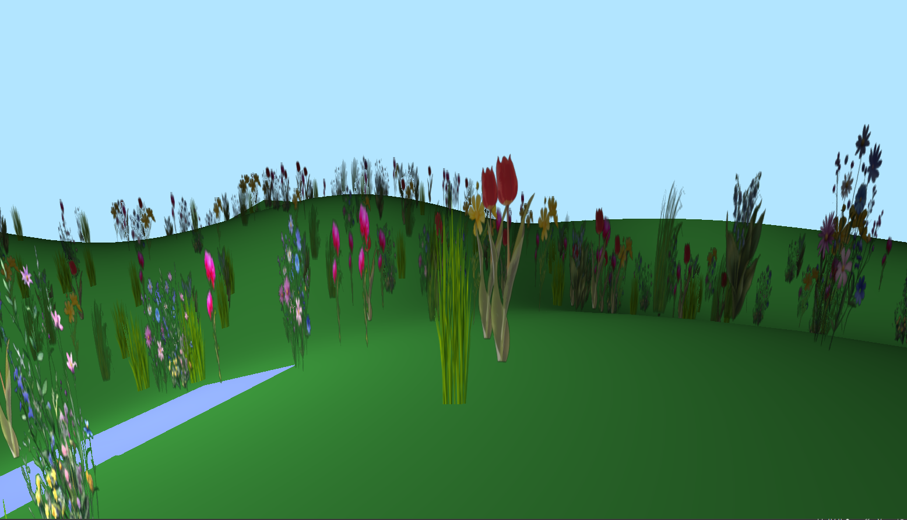

# Superbloom Wanderer

**Superbloom Wanderer** — это 3D-игра, созданная с использованием OpenTK (OpenGL) на C#. Игрок может исследовать процедурно сгенерированное поле с цветами и лужами. Игра демонстрирует базовые возможности рендеринга, включая освещение, инстансинг и управление камерой.

## Особенности
- **Динамическая камера**: Управление движением (WASD), прыжки (Пробел) и обзор мышью.
- **Процедурный ландшафт**: Генерация холмистой местности с цветами, размещёнными случайным образом.
- **Освещение**: Поддержка ambient и diffuse освещения для земли, цветов и луж.
- **Инстансинг**: Эффективный рендеринг множества цветов с использованием инстансинга.
---
*Создано с использованием OpenTK и вдохновлено красотой природы!*

